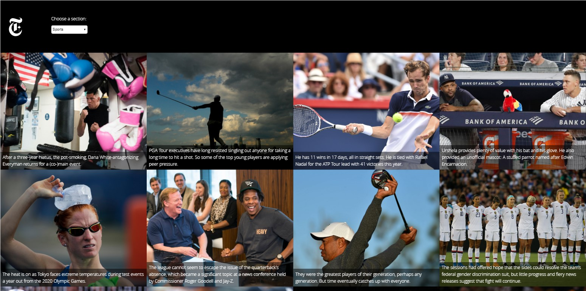

# Project Instanews

## Project Overview
This project makes use of the New York Times API to populate a website with 12 news articles. Each
article on the website contains a picture, an abstract, and a link to the full article selected. It uses jQuery's AJAX function to retrieve and render content.

## Technologies Used

* New York Times API
* Gulp
* Eslint

## HTML

HTML5 doctype

## SASS/CSS

* SASS as a preprocessor
* Implements layout with Grid
* Mobile Responsive
* Incorporates custom fonts using @font-face
* CSS animation

## JS/jQuery

* AJAX 
* JSON

## Personal Learnings

The Instanews project taught me how to fetch data from an external source and process it. I learned JSON and AJAX, and how to access specific pieces of information in a json file. I learned SASS to improve my stylesheets, CSS animation, and used GULP as a task manager to output minified build files. Building this website taught me about the HTML DOM, and how to use JavaScript to access and change the elements of an HTML document.

